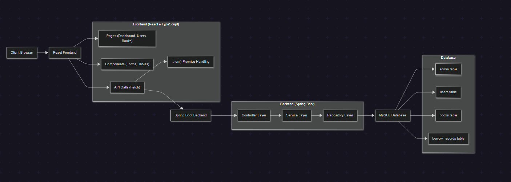
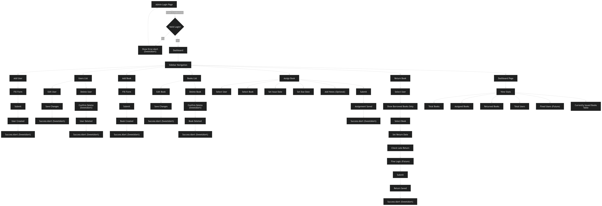
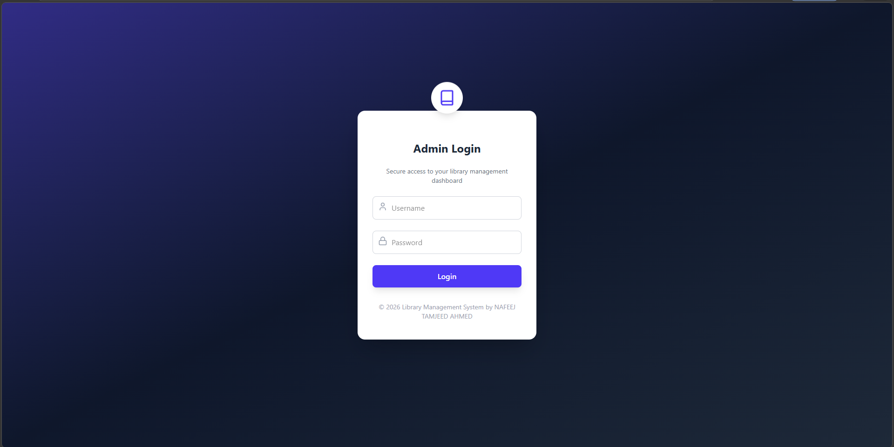
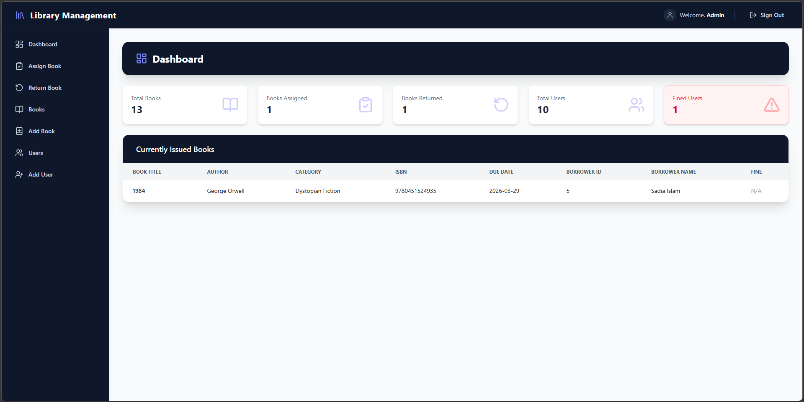
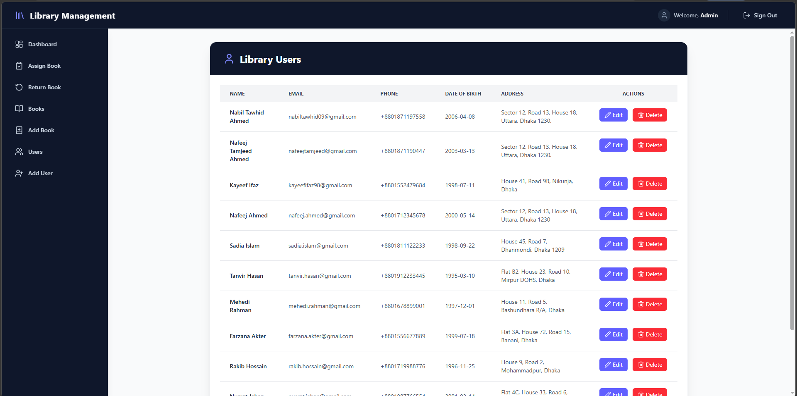
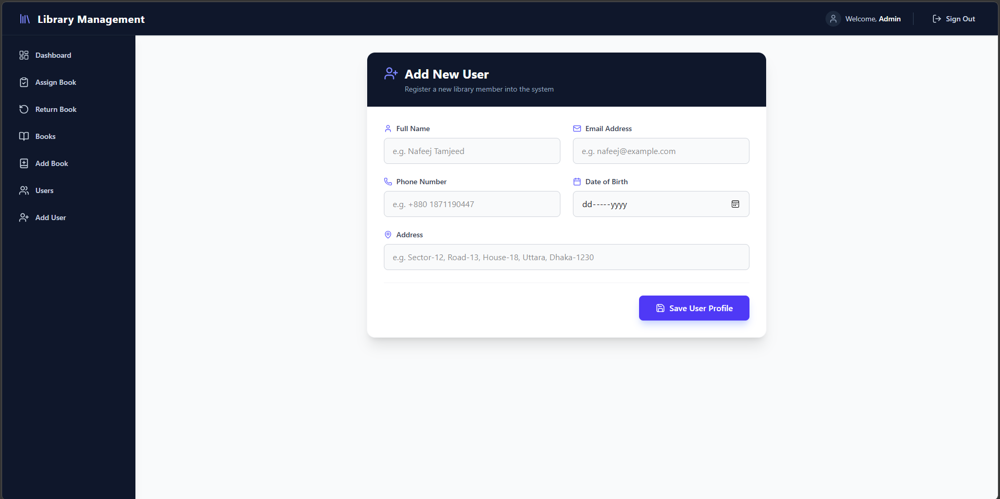
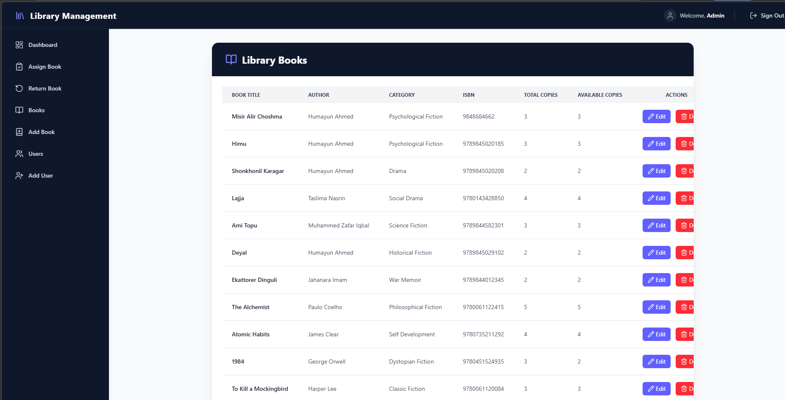
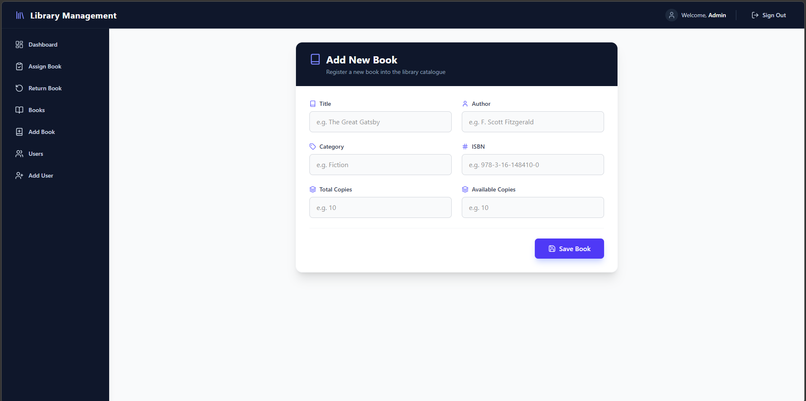
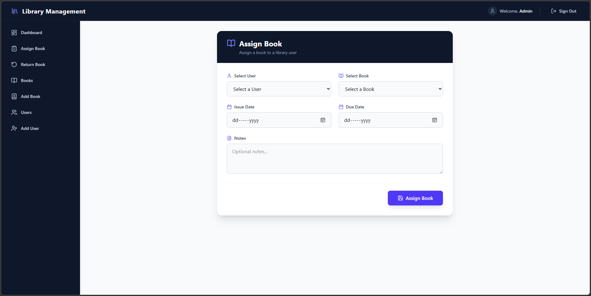
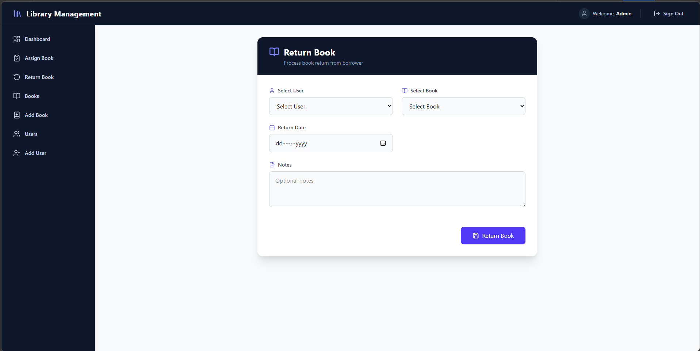

# 📚 Library Management System

---

## 🌐 Live Website: https://library-management-client-side-three.vercel.app/
- Github Repository for client side (LibraryManagement-Client-side): https://github.com/NAFEEJ007/LibraryManagement-Client-side
- Github Repository for server side (LibraryManagement-Server-side): https://github.com/NAFEEJ007/LibraryManagement-Server-side

## 📌 Overview

The **Library Management System** is a full-stack web application designed to efficiently manage books, users, and borrowing activities within a library.

It provides an intuitive admin interface with **sidebar-based navigation**, allowing seamless control over users, books, assignments, and returns.

This project demonstrates real-world software development practices including **clean architecture, relational database design, and user-focused UI/UX**.

---

## 🛠️ Tech Stack

### 🎨 Frontend
- React.js  
- TypeScript  
- Tailwind CSS  
- DaisyUI  
- SweetAlert (for alerts & confirmations)

### ⚙️ Backend
- Spring Boot  
- REST APIs  
- Layered Architecture (Controller → Service → Repository)

### 🗄️ Database
- MySQL  

---

## 🔐 Demo Login Credentials

> 📌 Use the following credentials to access the system:

- **Username:** `admin`  
- **Password:** `1234`  

💡 These credentials are stored in the **MySQL database** (`admin` table).

---

## ✨ Features

### 👤 Admin Panel
- Secure login system  
- Sidebar-based navigation  

---

### 👥 User Management
- Add new users  
- Edit user information  
- Soft delete users using `active` flag  
- View all users  

---

### 📚 Book Management
- Add new books  
- Edit book details  
- Soft delete books using `active` flag    
- View all books  

---

### 🔄 Book Assignment
- Assign books to users  
- Set issue date and due date  
- Add optional notes/instructions  

---

### 📥 Book Return System
- Shows only borrowed books for selected user  
- Tracks return date  
- Identifies late returns  
- Fine system planned for future  

---

### 📊 Dashboard
- Total books  
- Books assigned  
- Books returned  
- Total users  
- Fined users (future)  
- Currently issued books table  

---

### 🔔 User Experience Enhancements
- SweetAlert integration for:
  - ✅ Success messages  
  - ⚠️ Delete confirmations  
  - ❌ Error handling  

---

## 🧠 System Design Highlights

- 🔹 Layered backend architecture  
- 🔹 Soft delete strategy (`active` flag)  
- 🔹 Relational database design with foreign keys  
- 🔹 Smart filtering in return book workflow  
- 🔹 Scalable structure for future enhancements  

---

## 🖼️ System Architecture Diagram

---

## 🗃️ ER Diagram

---

## 🔄 Application Flow Diagram

---

## 📸 Screenshots

### 🔐 Login Page

### 📊 Dashboard

### 👥 Users Page

### 👥 Add Users Page

### 📚 Books Page

### 📚 Add Books Page

### 🔄 Assign Book

### 📥 Return Book

---

## 🚀 Future Work

### 💰 Fine Management System
- Show the list of users and their fines  

---

### 🔐 Role-Based Authentication
- Admin, Librarian, User roles  
- Secure access control  

---

### 🔍 Advanced Search & Filtering
- Search books and users  

---

### 📧 Notification System
- Email alerts for due dates and returns  

---

### 📊 Reports & Analytics
- Most borrowed books  

---

### 📱 UI/UX Improvements
- Animations and transitions  
- Dark mode  

---

## 🎯 Purpose

This project showcases:
- Full-stack development skills  
- Real-world system design  
- Database modeling  
- Clean and maintainable architecture  

It is designed to be **scalable, user-friendly, and production-ready**.

## 👨💻 Author

**Nafeej Tamjeed Ahmed**

---

## ⭐ Support

If you like this project, give it a ⭐ and feel free to fork!
